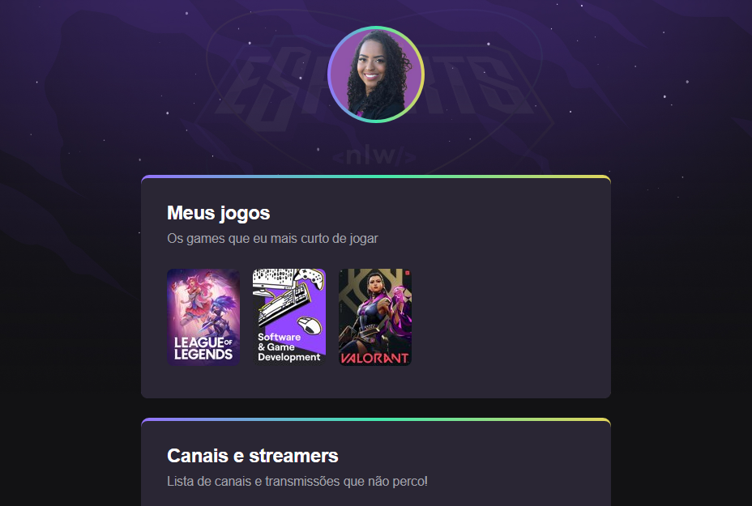

# NlW eSportes  

>  [Clique Aqui para acessar ](https://andreizahome.github.io/Nlw-esporte-explorer/)

# trilha explorer

Projeto construído no evento Next Level Week da Rocketseat.

# Tecnologias  

-Html

-Css

-Git e Github 

# Sobre o Projeto  

Um projeto bem estruturado com tecnologias atuais, com riquezas de detalhes
em Css. 

# O que achei sobre o projeto  

Para mim foram utilizados alguns desafios de estilização, que me fez ter um conhecimento maior e no final com um resultado incrível que me fez aprender e muito. 

Foi simplesmente incrível participar e fazer esse projeto. 

# Autora 

Andreiza Tainara, 22 anos
Estudando programação.

Aluna da ProduzDigital e na Rocketseat.

# Contato 

> andreiasouza6jjs7@gmail.com 

